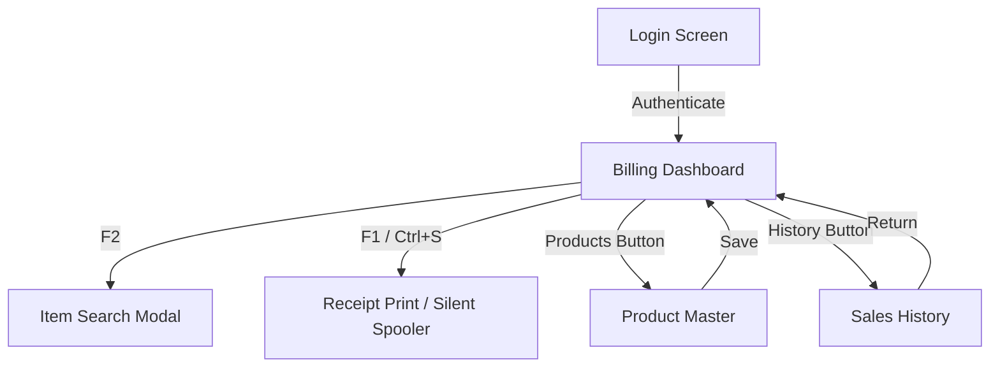

# ⚡ PS Billing System

[](https://tauri.app/)
[](https://www.rust-lang.org/)
[](https://react.dev/)
[](https://github.com/)

> **Offline POS Billing at the Speed of Thought — Rebuilt in Rust with Tauri.**

An offline-first, high-performance retail POS (Point of Sale) billing application designed for quick keyboard-only operations. Originally written in Electron, it has been completely replatformed into a **Tauri 2.0 + Rust** desktop architecture, delivering unmatched speed, zero-lag rendering, and robust printer integrations.

---

## 🚀 Performance Replatforming Metrics

| Metric | Electron (Legacy) | Tauri + Rust (Current) | Change |
| :--- | :--- | :--- | :--- |
| **Installer Size** | ~107 MB | **~3 MB** | **-97.2%** |
| **RAM Footprint** | ~220 MB | **~35 MB** | **-84.1%** |
| **Boot Time** | ~2.4 seconds | **~0.3 seconds** | **-87.5%** |
| **Database I/O** | JS Filesystem | **Atomic Rust Commands** | **Instant & Corrupt-proof** |

---

## 🌟 Application Windows & Detailed Functionalities



### 1. 🔑 Login Window
* **Fullscreen Startup:** The window launches automatically maximized and resizable from boot, fitting standard POS display resolutions (including target `1360*768` screens).
* **Local Authentication:** Simple keyboard-focused login flow using operator codes.
* **Store Slogan Banner:** Dynamically renders the shop name and header slogan directly from the local database settings.

### 2. 🛒 Billing Dashboard
The core workspace, optimized for **100% mouse-free keyboard traversal**:
* **Traversal Flow:** Type Code ➔ `Enter` (autofills item details) ➔ Type Qty ➔ `Enter` (applies slab pricing) ➔ Type Rate/Price override ➔ `Enter` (spins up a new row and resets focus to the Code field).
* **Duplicate Detection Dialog:** If an item is added twice, a warning popup prompts the operator to select:
  1. **Edit Existing:** Modify the quantity of the already listed item.
  2. **Add New Row:** List it again with a different weight/price override.
  * *Operators navigate options with Arrow keys and confirm with `Enter`.*
* **Alt + D:** Deletes the active row and automatically refocuses the preceding row.
* **F10 Hold Bin:** Parks the current invoice to serve a different customer and restores it later with a single keystroke.
* **Large Cash Card:** Color-coded summaries showing Gross, Discount (Red), Labor/Coolie (Blue), Rent (Purple), and a giant Net Total display.

### 3. 🔍 Product Search Overlay (F2)
* **Fuzzy Filtering:** Instantly filters products by Code, English Name, Group, or Tamil Name.
* **Instant Insertion:** Navigating the results using `ArrowUp` / `ArrowDown` and pressing `Enter` inserts the selected item directly into the active billing row.
* **Press Esc:** Instantly closes the overlay and returns focus to the billing table.

### 4. 📦 Product Master (Inventory Manager)
* **Full Database Ledger:** Grid viewing stock levels, Cost Price, MRP, and active item status.
* **Custom Slab Configurations:** Allows owners to set custom weight-based offsets (e.g. `+10` or `-110` applied to 1kg base rate) for fractional items (sugar, spices, flour) to automate custom wholesale margins.

### 5. 📜 Sales History (Transactions Ledger)
* **Invoices Database:** Chronological ledger of all saved billing records.
* **Search Filters:** Filters records instantly by Bill Number, Date Ranges, Customer Name, or Phone.
* **Data Exporter:** Exports sales records to a standard `.csv` spreadsheet with a single click.
* **Daily Metrics:** Displays total sales count and cumulative revenue summaries.

### 6. 🖨️ Thermal Print Spooler (Silent Print)
* **Edge WebView2 Kiosk Integration:** Configured with `WEBVIEW2_ADDITIONAL_BROWSER_ARGUMENTS="--kiosk-printing"` in the Rust core, completely bypassing the default Windows print confirmation windows.
* **Click-free Print:** Pressing `F1` or `Ctrl + S` instantly triggers the thermal print command, spooling directly to the default POS roll printer and closing the modal automatically after 500ms.
* **Contrast Filter:** Receipt stylesheet features crisp borders, monochrome branding text, and no dithering to prevent print faintness on standard 80mm rolls.

---

## 🛠️ Tech Stack & Engineering
* **Frontend:** React 19, Vite, Vanilla CSS.
* **Backend:** Rust 1.97 (Tauri 2.0 App Runtime).
  * *Fast File I/O:* Rust atomic buffer writer (`.json.tmp` rename pattern) prevents database corruption.
  * *Rotation Logs:* Internal logger appends messages to `app.log` with a strict `1MB` file cap.
* **Target Platforms:** Windows (x64 architectures).

---

## 🚀 Getting Started

### Prerequisites
* [Node.js](https://nodejs.org/) (v20+)
* [Rust & Cargo](https://www.rust-lang.org/) (MSVC Compiler + Windows 11 SDK via VS Community)

### Development
1. Clone this repository:
   ```bash
   git clone https://github.com/iam-tarun-86/PS_billing_system.git
   cd PS_billing_system
   ```
2. Build the Tauri wrapper project:
   ```bash
   cd tari
   npm install
   npm run dev
   ```

### Packaging the Desktop App
To build the standalone `.exe` and the NSIS Setup Installer:
1. Double-click the helper script: [`tari/build_tauri.bat`](file:///c:/Users/tarun/Downloads/COLLEGE/projects/ps/tari/build_tauri.bat).
2. The setup packages will be generated inside:
   * **NSIS Installer:** `tari/src-tauri/target/release/bundle/nsis/`
   * **Standalone Exe:** `tari/src-tauri/target/release/app.exe`
