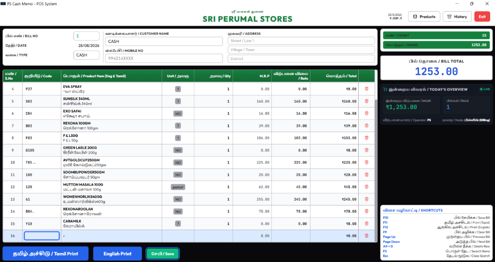
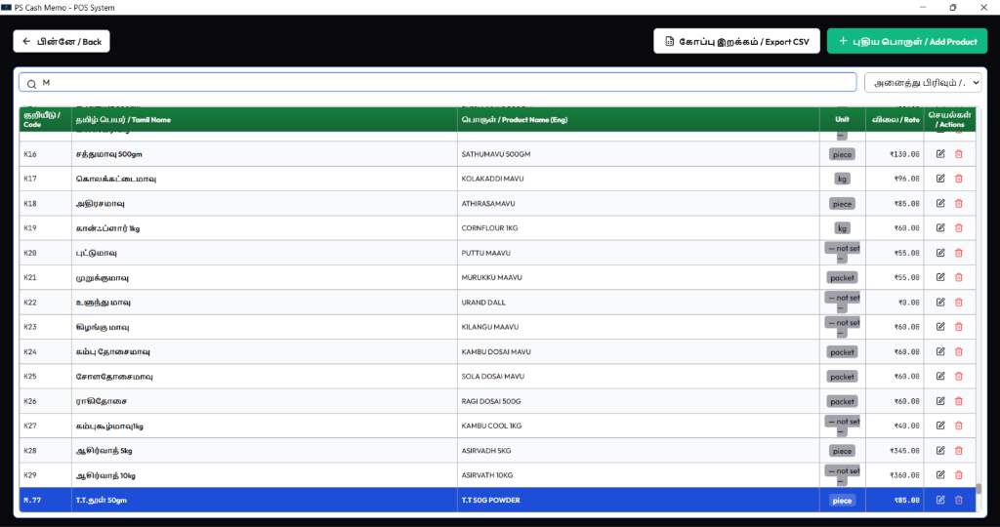
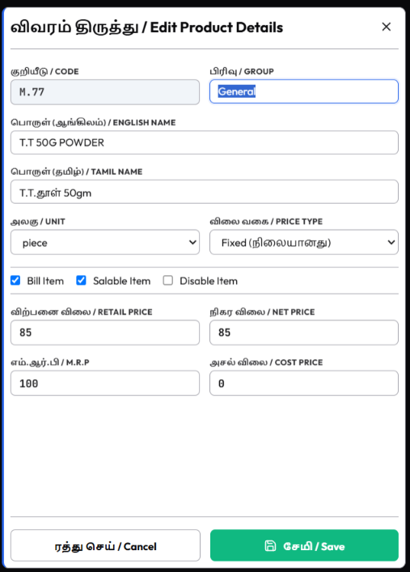
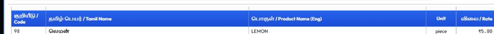
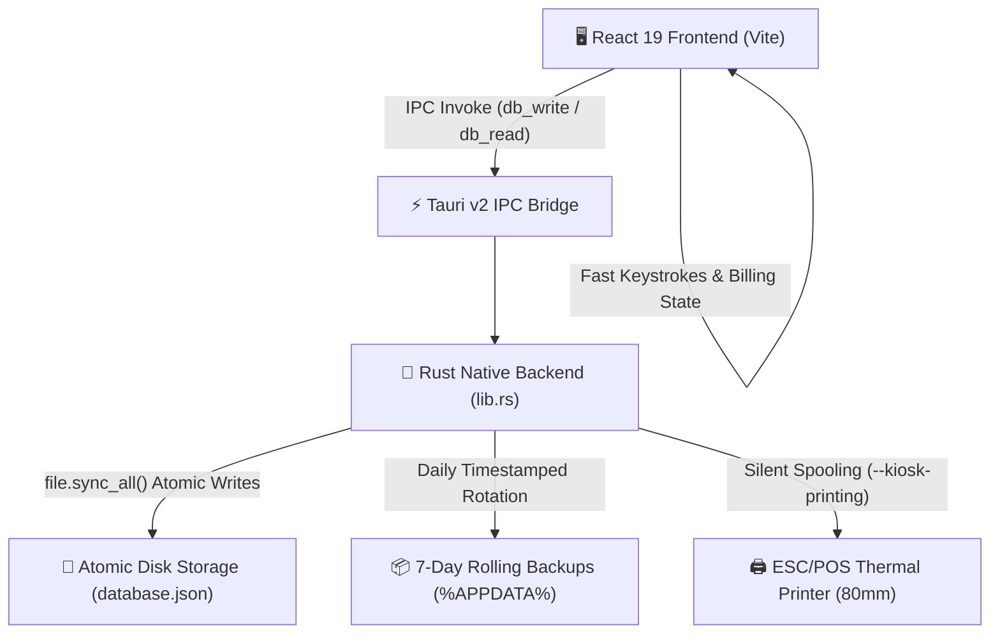

<div align="center">

# 🏪 SRI PERUMAL STORES (ஸ்ரீ பெருமாள் ஸ்டோர்ஸ்)
### *Express POS & Retail Billing System · PS Cash Memo*

> **"From 20 Years of DOS-Era FoxPro to Sub-Millisecond Rust Performance."**  
> **"Zero Mouse. Zero Delay. 100% Muscle Memory."**

[](https://tauri.app)
[](https://www.rust-lang.org)
[](https://react.dev)
[](https://vitejs.dev)
[]()
[]()

---



*Figure 1: High-throughput Tamil-first billing counter with real-time totals, today's sales overview, and keyboard shortcut guide.*

</div>

---

## ⚡ The Punchline: Why This Exists

Most modern POS systems are bloated, mouse-heavy web apps that fall apart during the 7:00 PM evening grocery rush. 

**PS Cash Memo was built for the battlefield of Indian retail:**
- 🚫 **No Mouse Required:** 100% of store operations—from item lookup to slab overrides and printing—are executed with keyboard hotkeys.
- ⚡ **Instantaneous Startup & Zero Lag:** Native Rust binary with Tauri v2 draws less than 40MB RAM and launches in under 400ms.
- ⚖️ **Fractional Gram Grocery Slabs:** Built-in dynamic pricing engine that handles 50g, 100g, 250g, 500g, and 1kg packet offsets automatically.
- 📜 **FoxPro Muscle Memory Preserved:** 1,803 store products and 35 authentic departments migrated with zero disruption to the shopkeeper's 20-year workflow.

---

## 🌟 Core Superpowers

### 1. 🚀 Dual-Search Mode (Code Jump vs. Name Filter)
The search engine understands whether the shopkeeper is typing a **Product Code Family** or a **Product Name**:
- **Code Searches (`M`, `M2`, `K`, `12`):** Instantly **jumps** the cursor to the exact item (e.g. `M20`) while keeping the entire 1,803-item store catalogue loaded, allowing free `ArrowUp` into `M1` and `ArrowDown` into `M3`.
- **Name Searches (`HAMAM`, `EGG`, `POOJA`):** **Filters** the shelf dynamically, displaying exact name matches at the top and department aisles below.
- **Sticky-Header Clearance:** Search jumps and arrow navigation calculate dynamic header clearance so focused items are **never hidden behind the green table header**.

<div align="center">
  
  <p><em>Figure 2: Master catalogue showing 35 authentic FoxPro departments with jump alignment.</em></p>
</div>

---

### 2. ⚖️ Intelligent Grocery Weight Fractioning & Slab Offsets
Selling 50g of Jeera is not simply $\frac{1}{20}\text{th}$ of 1kg. Indian grocery packaging incurs packet, labour, and retail margins.

$$\text{Packet Price} = (\text{Base Price} + \text{Slab Offset}) \times \left(\frac{\text{Grams}}{1000}\right)$$

* **Real Store Example (M47 Jeera - ₹380/kg Base Rate):**
  * `50g (0.050 kg)` $\to$ **₹24.50** (with +₹110/kg offset)
  * `100g (0.100 kg)` $\to$ **₹49.00** (with +₹110/kg offset)
  * `250g (0.250 kg)` $\to$ **₹95.00** (with +₹0 offset)
  * `500g (0.500 kg)` $\to$ **₹190.00** (with +₹0 offset)
  * `1kg (1.000 kg)` $\to$ **₹380.00**

---

### 3. 📂 35 Authentic FoxPro Store Departments
Every single one of the 1,803 items is categorized into its genuine departmental family:

| Group | Department Name | Tamil Description | Items |
| :---: | :--- | :--- | :---: |
| **`M`** | `M.MALIGAI` | மளிகை பொருட்கள் (Jeera, Mustard, Sugar, Salt) | **121** |
| **`W`** | `W.WASINGSOAP/POWDER` | துணி சோப்பு & பவுடர் (Rin, Surf Excel, Wheel) | **93** |
| **`4`** | `4.POOJA PRODUCTS` | பூஜை பொருட்கள் (Agarbatti, Camphor, Vibhuti) | **89** |
| **`Z`** | `Z.OTHERS` | இதர கடை பொருட்கள் (Store Catch-All) | **85** |
| **`B`** | `B.BOTH SOAP` | குளியல் சோப்பு (Hamam, Medimix, Lifebuoy) | **84** |
| **`1`** | `1.MASALA PRODUCTS` | மசாலா வகைகள் (Mutton Masala, Sambar Powder) | **78** |
| **`O`** | `O.OIL/DALDA` | எண்ணெய் & டால்டா (Sunflower, Gingelly, Dalda) | **76** |
| **`3`** | `3.TOOTHPASTE/POWDER` | பல் பேஸ்ட் & பொடி (Colgate, Close Up, Gopal) | **72** |
| **`S`** | `S.SHAMPOO` | ஷாம்பூ வகைகள் (Clinic Plus, Sunsilk, Meera) | **70** |
| **`T`** | `T.TEA/COFFEE` | டீ & காபி தூள் (3 Roses, Bru, Red Label) | **66** |
| **`6`** | `6.HEALTH DRINKS` | ஹெல்த் டிரிங்க்ஸ் (Horlicks, Boost, Complan) | **66** |
| **`9`** | `9.INSECT REPLEANCES` | கொசுவர்த்தி & ஹிட் (Good Knight, All Out, Hit) | **66** |
| **`7`** | `7.BABY PRODUCTS` | குழந்தை பொருட்கள் (Johnson Baby, Cerelac) | **63** |
| **`D`** | `D.DRY FRUITS/NUTS` | உலர் பழங்கள் & நட்ஸ் (முந்திரி, பாதாம், Kismis) | **53** |
| **`K`** | `K.FLOUR POWDER` | மாவு வகைகள் (Puttu Maavu, Murukku Maavu, Ragi) | **30** |

<div align="center">
  
  <p><em>Figure 3: Product Edit Modal with unlocked item code, strict duplicate guard, and department dropdown.</em></p>
</div>

---

### 4. 🧾 Direct Silent Thermal Printing (3-Inch / 80mm Roll)
* **High-Visibility Header:** 17px bold phone header (`📞 9942143460, 9629708861`) immediately below shop title.
* **Handwriting Ledger Buffer:** 3 ruled dotted lines below the single rounded total for manual clerk notes.
* **Bilingual Settle Hotkeys:** `F11` (Tamil Print), `F12` (English Print), `F10` (Save Only).
* **Silent Spooling:** Uses native ESC/POS background spooling (`--kiosk-printing`) with zero print dialog latency.

<div align="center">
  
  <p><em>Figure 4: Pixel-perfect thermal receipt with 17px bold header, bilingual line items, and handwriting buffer.</em></p>
</div>

---

### 5. 🛡️ Rock-Solid Disk Engine & Future-Proof Auditing
- **Atomic Writes:** Rust backend commits database updates via `.json.tmp` + atomic rename + `file.sync_all()`, guaranteeing zero partial write corruption on power loss.
- **7-Day Rolling Backups:** Automated rolling backups created in `%APPDATA%\com.perumalstores.psbilling\backups\`.
- **Cascade Code Renames:** Renaming an item code in Product Manager cascades across all historical bills in `database.transactions` and records the chain in `settings.codeRenames`.
- **Archive Remapping (`archive_history.mjs --restore`):** When restoring historical archives, older bills automatically remap to the new product codes using rename logs and unique names.

---

## ⌨️ Master Keyboard Shortcuts

| Hotkey | Action | Behavior & Context |
| :---: | :--- | :--- |
| **`Enter`** | **Step Through** | Code $\to$ Qty $\to$ Rate $\to$ Auto-creates Next Row. |
| **`Enter`** *(on empty code)* | **Open Product Search** | Opens instant search overlay across Tamil & English catalogue. |
| **`ArrowUp` / `ArrowDown`** | **Navigate Grid** | Seamlessly walks through rows with 6px sticky header clearance. |
| **`ArrowLeft` / `ArrowRight`** | **Column Traversal** | Move between Code, Qty, and Rate cells instantly. |
| **`Alt + D`** | **Delete Row** | Deletes the active line item and adjusts totals instantly. |
| **`PageUp`** | **Previous Bill** | Loads previous saved bill with focus placed on **Row 1** at top. |
| **`PageDown`** | **Next Bill** | Loads next saved bill or returns smoothly to active draft. |
| **`F10`** | **Save Bill Only** | Saves bill to local disk and clears screen for next customer. |
| **`F11`** | **Save & Print Tamil** | Saves bill and triggers instant silent receipt in Tamil. |
| **`F12`** | **Save & Print English** | Saves bill and triggers instant silent receipt in English. |
| **`F9`** | **Clear Bill** | Clears screen and resets counter to start a clean new bill. |
| **`Esc`** | **Close / Exit** | Dismisses search overlays, dropdowns, or returns to previous screen. |

---

## 🏗️ System Architecture



---

## 📦 Installation & Setup

### 1. Download Latest Production Installer
Grab the verified Windows executable:
👉 **[`ps-billing-system_latest_setup.exe`](./ps-billing-system_latest_setup.exe)** *(3.17 MB)*

### 2. Development Setup
```bash
# Clone repository
git clone https://github.com/iam-tarun-86/PS_billing_system.git
cd PS_billing_system/tari

# Install frontend dependencies
npm install

# Run frontend in development mode
npm run dev:frontend

# Run full desktop app in Tauri dev mode
npm run dev

# Compile optimized release installer (.exe + .msi)
npm run build
```

---

<div align="center">

### 🏬 Sri Perumal Stores (ஸ்ரீ பெருமாள் ஸ்டோர்ஸ்)
*Dedicated to fast, honest, and reliable local grocery retail.*

Made with ❤️ by Tarun & Google Antigravity

</div>
